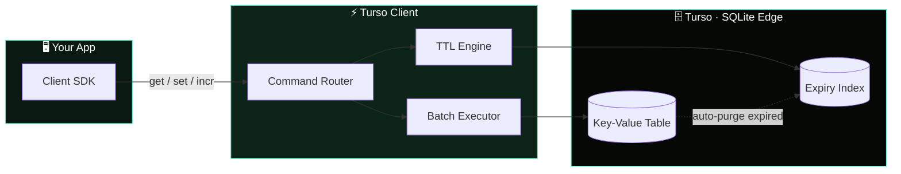

<div align="center">


#  <svg class="h-6 w-auto" viewBox="0 0 741 170" fill="none" xmlns="http://www.w3.org/2000/svg"><path d="M171.765 0V30.78L157.225 34.53L148.115 23.56L143.305 33.02C133.385 30.32 119.725 28.58 100.935 28.58C82.1451 28.58 68.4851 30.33 58.5651 33.02L53.7551 23.56L44.6451 34.53L30.1051 30.78V0C30.1051 0 5.61507 20.67 0.945068 48.61L33.0851 59.73C34.1351 79.16 42.8751 131.61 45.3751 136.37C48.0351 141.44 62.1551 155.93 73.2051 161.5C73.2051 161.5 77.2051 157.27 79.6451 153.54C82.7451 157.19 98.7551 169.99 100.945 169.99C103.135 169.99 119.145 157.19 122.245 153.54C124.685 157.27 128.685 161.5 128.685 161.5C139.735 155.93 153.855 141.44 156.515 136.37C159.015 131.61 167.755 79.16 168.805 59.73L200.945 48.61C196.255 20.67 171.765 0 171.765 0ZM154.725 93.36L132.975 95.3L134.885 121.97C134.885 121.97 121.655 132.92 100.925 132.92C80.1951 132.92 66.9651 121.97 66.9651 121.97L68.8751 95.3L47.1251 93.36L43.4051 63.32L79.4551 75.8L76.6551 113.19C83.3551 114.89 90.4051 116.58 100.935 116.58C111.465 116.58 118.505 114.89 125.205 113.19L122.405 75.8L158.455 63.32L154.735 93.36H154.725Z" fill="#4FF8D2"></path><path d="M240.225 49.42L271.295 53.24V142.83H299.255V53.24L330.155 49.42V27.17H240.225V49.42Z" fill="#4FF8D2"></path><path d="M406.505 96.53C406.505 109.57 400.145 118.76 386.915 118.76C373.685 118.76 366.985 109.74 366.985 96.7V27.17H339.025V96.7C339.025 125.61 353.925 145 386.585 145C419.245 145 434.475 124.44 434.475 96.53V27.17H406.515V96.53H406.505Z" fill="#4FF8D2"></path><path d="M524.555 61.6C524.555 39.71 512.325 27.17 488.055 27.17H448.205V142.82H476.005V95.35H483.545L506.315 142.82H536.285L509.825 90.01C519.205 84.33 524.565 74.47 524.565 61.6H524.555ZM485.705 72.63H475.995V51.24H485.705C491.895 51.24 495.745 55.42 495.745 61.77C495.745 68.12 492.065 72.63 485.705 72.63Z" fill="#4FF8D2"></path><path d="M588.685 74.47L574.115 68.79C566.245 65.78 563.565 62.44 563.565 57.59C563.565 52.74 566.745 48.9 573.115 48.9C579.485 48.9 583.325 53.91 583.165 61.1H608.945C610.125 40.54 600.245 25 572.945 25C550.345 25 535.605 39.04 535.605 59.26C535.605 73.3 541.795 84.66 553.525 90.68C559.885 93.86 565.745 96.03 571.605 98.37C579.135 101.21 583.825 104.39 583.825 110.9C583.825 117.41 579.135 121.1 572.775 121.1C563.565 121.1 560.715 113.91 561.055 106.56H534.595C533.595 123.44 539.615 145 572.775 145C596.045 145 612.625 131.3 612.625 107.9C612.625 90.69 603.745 80.66 588.675 74.47H588.685Z" fill="#4FF8D2"></path><path d="M678.775 25C643.115 25 618.665 51.57 618.665 85.17C618.665 118.77 641.775 145 679.615 145C717.455 145 740.235 118.43 740.235 84.67C740.235 50.91 716.625 25 678.775 25ZM679.445 118.93C660.185 118.93 647.965 104.06 647.965 85C647.965 65.94 658.855 51.07 679.275 51.07C699.695 51.07 710.925 66.11 710.925 85C710.925 103.89 699.875 118.93 679.445 118.93Z" fill="#4FF8D2"></path></svg> Turso Client

**A key value store built on Turso (SQLite)**

[](https://bun.sh)
[](https://nodejs.org)
[](https://www.typescriptlang.org/)

</div>

---

## Overview

Turso Client gives you a familiar Redis-style API system — backed by [Turso](https://turso.tech), 
Turso is a distributed SQLite database. 
Use tursoClient it when you want Redis-like ergonomics without running a separate Redis instance, and you're already on (or want) SQLite-based storage.

## Tech Stack

| Technology | Purpose |
|---|---|
| [Turso](https://turso.tech) | Distributed SQLite database (storage layer) |
| [Bun](https://bun.sh) | Primary JS runtime & toolkit |
| [Node.js](https://nodejs.org) 18+ | Alternative runtime |
| [TypeScript](https://www.typescriptlang.org/) | Type-safe client API |

## Features

- **Redis-like API** — familiar method names and semantics
- **TTL support** — expire keys automatically
- **Atomic operations** — safe increments/decrements
- **Batch operations** — operate on multiple keys at once
- **Persistent storage** — durable, backed by SQLite
- **Auto cleanup** — expired keys are purged automatically
- **Pattern matching** — `keys()` and `scan()` support glob patterns
- **Distributed locks** — coordinate across processes

## Architecture

A quick look at how a command flows from your app down to Turso's edge storage:



## Installation

```bash
# Bun
bun add turso-client

# npm
npm install turso-client
```

## Quick Start

```ts
import { createClient } from "turso-client";

const client = createClient({
  url: process.env.TURSO_DATABASE_URL!,
  authToken: process.env.TURSO_AUTH_TOKEN!,
});

await client.set("session:123", "active", 3600); // expires in 1h
const value = await client.get("session:123");
```

## Commands

### Core

| Command | Description |
|---|---|
| `set(key, value, ttl?)` | Store a value, optionally with a TTL (seconds) |
| `get(key)` | Retrieve a value |
| `del(...keys)` | Delete one or more keys |
| `exists(key)` | Check whether a key exists |

### TTL

| Command | Description |
|---|---|
| `ttl(key)` | Get remaining time-to-live for a key |
| `expire(key, seconds)` | Set/update a key's expiration |
| `persist(key)` | Remove a key's TTL (make it permanent) |

### Numeric

| Command | Description |
|---|---|
| `incr(key)` | Increment a value by 1 |
| `incrby(key, n)` | Increment a value by `n` |
| `decr(key)` | Decrement a value by 1 |

### Scan

| Command | Description |
|---|---|
| `keys(pattern)` | List keys matching a glob pattern |
| `scan(cursor, pattern)` | Paginate through keys matching a pattern |
## License

[MIT](LICENSE)
