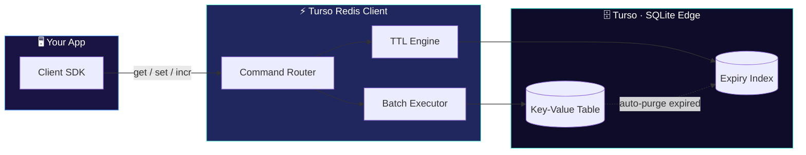

<div align="center">


# Turso Redis Client

**A Redis-like key-value store built on Turso (SQLite)**

[](https://bun.sh)
[](https://nodejs.org)
[](https://www.typescriptlang.org/)
[](https://www.npmjs.com/package/turso-redis-client)
[](LICENSE)
[](CONTRIBUTING.md)

</div>

---

## Overview

Turso Redis Client gives you a familiar Redis-style API — `get`, `set`, `expire`, `incr`, `scan`, and more — backed by [Turso](https://turso.tech), a distributed SQLite database. Use it when you want Redis-like ergonomics without running a separate Redis instance, and you're already on (or want) SQLite-based storage.

## Tech Stack

| Technology | Purpose |
|---|---|
| [Turso](https://turso.tech) | Distributed SQLite database (storage layer) |
| [Bun](https://bun.sh) | Primary JS runtime & toolkit |
| [Node.js](https://nodejs.org) 18+ | Alternative runtime |
| [TypeScript](https://www.typescriptlang.org/) | Type-safe client API |

## Features

- **Redis-like API** — familiar method names and semantics
- **TTL support** — expire keys automatically
- **Atomic operations** — safe increments/decrements
- **Batch operations** — operate on multiple keys at once
- **Persistent storage** — durable, backed by SQLite
- **Auto cleanup** — expired keys are purged automatically
- **Pattern matching** — `keys()` and `scan()` support glob patterns
- **Distributed locks** — coordinate across processes

## Architecture

A quick look at how a command flows from your app down to Turso's edge storage:



## Installation

```bash
# Bun
bun add turso-redis-client

# npm
npm install turso-redis-client
```

## Quick Start

```ts
import { createClient } from "turso-redis-client";

const client = createClient({
  url: process.env.TURSO_DATABASE_URL!,
  authToken: process.env.TURSO_AUTH_TOKEN!,
});

await client.set("session:123", "active", 3600); // expires in 1h
const value = await client.get("session:123");
```

## Commands

### Core

| Command | Description |
|---|---|
| `set(key, value, ttl?)` | Store a value, optionally with a TTL (seconds) |
| `get(key)` | Retrieve a value |
| `del(...keys)` | Delete one or more keys |
| `exists(key)` | Check whether a key exists |

### TTL

| Command | Description |
|---|---|
| `ttl(key)` | Get remaining time-to-live for a key |
| `expire(key, seconds)` | Set/update a key's expiration |
| `persist(key)` | Remove a key's TTL (make it permanent) |

### Numeric

| Command | Description |
|---|---|
| `incr(key)` | Increment a value by 1 |
| `incrby(key, n)` | Increment a value by `n` |
| `decr(key)` | Decrement a value by 1 |

### Scan

| Command | Description |
|---|---|
| `keys(pattern)` | List keys matching a glob pattern |
| `scan(cursor, pattern)` | Paginate through keys matching a pattern |

## Contributing

Contributions are welcome — see [CONTRIBUTING.md](CONTRIBUTING.md) for guidelines.

## License

[MIT](LICENSE)
