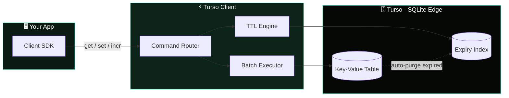

<div align="center">

<div style="display: flex; align-items: center; gap: 0;">
    
    <span style="font-size: 100px; font-weight: bold; line-height: 1;">Client</span>
</div>

**A key value store built on Turso (SQLite)**
</div>

---

## Overview

Turso Client gives you a familiar Redis-style API system — backed by [Turso](https://turso.tech), 
Turso is a distributed SQLite database. 
Use tursoClient it when you want Redis-like ergonomics without running a separate Redis instance, and you're already on (or want) SQLite-based storage.
## Features

- **Key Value API** — familiar method names and semantics
- **TTL support** — expire keys automatically
- **Atomic operations** — safe increments/decrements
- **Batch operations** — operate on multiple keys at once
- **Persistent storage** — durable, backed by SQLite
- **Auto cleanup** — expired keys are purged automatically
- **Pattern matching** — `keys()` and `scan()` support glob patterns
- **Distributed locks** — coordinate across processes

## Architecture

A quick look at how a command flows from your app down to Turso's edge storage:



## Installation

```bash
# Bun
bun add https://github.com/DivyaVaibhav01/tursoClient.git

# npm
npm install https://github.com/DivyaVaibhav01/tursoClient.git
```

## Quick Start

```ts
import tursoClient from "tursoClient/client";

const client = new createClient({
  url: process.env.TURSO_DATABASE_URL!,
  token: process.env.TURSO_AUTH_TOKEN!,
});

client.on('ready', async () => {
    console.log('Client is ready');

    await client.set('vData', {
        enviroment: 'turso',
        project: "tursoClient"
    }).then(async (result) => {
        console.log('Set result:', result);

        await client.get('vData').then((value) => {
            console.log('Get value:', value);
        }).catch((error) => {
            console.error('Get error:', error);
        });
    }).catch((error) => {
        console.error('Set error:', error);
    });
});


client.on('error', (error) => {
    console.error('Error:', error);
});   
```

## Commands

### Core

| Command | Description |
|---|---|
| `set(key, value, ttl?)` | Store a value, optionally with a TTL (seconds) |
| `get(key)` | Retrieve a value |
| `del(...keys)` | Delete one or more keys |
| `exists(key)` | Check whether a key exists |

### TTL

| Command | Description |
|---|---|
| `ttl(key)` | Get remaining time-to-live for a key |
| `expire(key, seconds)` | Set/update a key's expiration |
| `persist(key)` | Remove a key's TTL (make it permanent) |

### Numeric

| Command | Description |
|---|---|
| `incr(key)` | Increment a value by 1 |
| `incrby(key, n)` | Increment a value by `n` |
| `decr(key)` | Decrement a value by 1 |

### Scan

| Command | Description |
|---|---|
| `keys(pattern)` | List keys matching a glob pattern |
| `scan(cursor, pattern)` | Paginate through keys matching a pattern |
