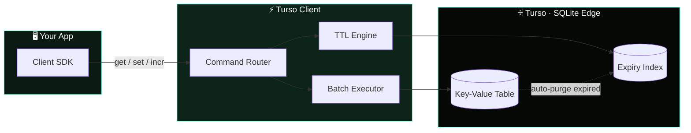

<div align="center">

<svg width="100%" height="220" viewBox="0 0 1200 300" xmlns="http://www.w3.org/2000/svg">
  <defs>
    <linearGradient id="bg" x1="0%" y1="0%" x2="100%" y2="100%">
      <stop offset="0%" stop-color="#050805"/>
      <stop offset="50%" stop-color="#0a1a12"/>
      <stop offset="100%" stop-color="#0c2418"/>
    </linearGradient>
    <radialGradient id="glow" cx="50%" cy="50%" r="50%">
      <stop offset="0%" stop-color="#4FF8D2" stop-opacity="0.35"/>
      <stop offset="100%" stop-color="#4FF8D2" stop-opacity="0"/>
    </radialGradient>
  </defs>

  <rect width="1200" height="300" fill="url(#bg)"/>

  <ellipse cx="160" cy="150" rx="150" ry="150" fill="url(#glow)"/>

  <g fill="#4FF8D2" opacity="0.2">
    <circle cx="980" cy="40" r="2"/>
    <circle cx="1040" cy="90" r="1.5"/>
    <circle cx="900" cy="70" r="1.5"/>
    <circle cx="1100" cy="50" r="2"/>
    <circle cx="1150" cy="120" r="1.5"/>
    <circle cx="60" cy="240" r="1.5"/>
    <circle cx="120" cy="265" r="1.5"/>
    <circle cx="1000" cy="240" r="1.5"/>
  </g>

  <g transform="translate(60,80) scale(0.7)">
    <path d="M171.765 0V30.78L157.225 34.53L148.115 23.56L143.305 33.02C133.385 30.32 119.725 28.58 100.935 28.58C82.1451 28.58 68.4851 30.33 58.5651 33.02L53.7551 23.56L44.6451 34.53L30.1051 30.78V0C30.1051 0 5.61507 20.67 0.945068 48.61L33.0851 59.73C34.1351 79.16 42.8751 131.61 45.3751 136.37C48.0351 141.44 62.1551 155.93 73.2051 161.5C73.2051 161.5 77.2051 157.27 79.6451 153.54C82.7451 157.19 98.7551 169.99 100.945 169.99C103.135 169.99 119.145 157.19 122.245 153.54C124.685 157.27 128.685 161.5 128.685 161.5C139.735 155.93 153.855 141.44 156.515 136.37C159.015 131.61 167.755 79.16 168.805 59.73L200.945 48.61C196.255 20.67 171.765 0 171.765 0ZM154.725 93.36L132.975 95.3L134.885 121.97C134.885 121.97 121.655 132.92 100.925 132.92C80.1951 132.92 66.9651 121.97 66.9651 121.97L68.8751 95.3L47.1251 93.36L43.4051 63.32L79.4551 75.8L76.6551 113.19C83.3551 114.89 90.4051 116.58 100.935 116.58C111.465 116.58 118.505 114.89 125.205 113.19L122.405 75.8L158.455 63.32L154.735 93.36H154.725Z" fill="#4FF8D2"/>
  </g>

  <text x="640" y="135" font-family="Segoe UI, Helvetica, Arial, sans-serif" font-size="50" font-weight="700" fill="#ffffff" text-anchor="middle">
    Turso Client
  </text>
  <text x="640" y="178" font-family="Segoe UI, Helvetica, Arial, sans-serif" font-size="20" font-weight="400" fill="#8fd6c1" text-anchor="middle">
    A Redis-like key-value store, powered by Turso (SQLite)
  </text>

  <rect x="520" y="200" width="240" height="4" rx="2" fill="#4FF8D2"/>
</svg>

# Turso Client

**A Redis-like key-value store built on Turso (SQLite)**

[](https://bun.sh)
[](https://nodejs.org)
[](https://www.typescriptlang.org/)
[](https://www.npmjs.com/package/turso-client)
[](LICENSE)
[](CONTRIBUTING.md)

</div>

---

## Overview

Turso Client gives you a familiar Redis-style API — `get`, `set`, `expire`, `incr`, `scan`, and more — backed by [Turso](https://turso.tech), a distributed SQLite database. Use it when you want Redis-like ergonomics without running a separate Redis instance, and you're already on (or want) SQLite-based storage.

## Tech Stack

| Technology | Purpose |
|---|---|
| [Turso](https://turso.tech) | Distributed SQLite database (storage layer) |
| [Bun](https://bun.sh) | Primary JS runtime & toolkit |
| [Node.js](https://nodejs.org) 18+ | Alternative runtime |
| [TypeScript](https://www.typescriptlang.org/) | Type-safe client API |

## Features

- **Redis-like API** — familiar method names and semantics
- **TTL support** — expire keys automatically
- **Atomic operations** — safe increments/decrements
- **Batch operations** — operate on multiple keys at once
- **Persistent storage** — durable, backed by SQLite
- **Auto cleanup** — expired keys are purged automatically
- **Pattern matching** — `keys()` and `scan()` support glob patterns
- **Distributed locks** — coordinate across processes

## Architecture

A quick look at how a command flows from your app down to Turso's edge storage:



## Installation

```bash
# Bun
bun add turso-client

# npm
npm install turso-client
```

## Quick Start

```ts
import { createClient } from "turso-client";

const client = createClient({
  url: process.env.TURSO_DATABASE_URL!,
  authToken: process.env.TURSO_AUTH_TOKEN!,
});

await client.set("session:123", "active", 3600); // expires in 1h
const value = await client.get("session:123");
```

## Commands

### Core

| Command | Description |
|---|---|
| `set(key, value, ttl?)` | Store a value, optionally with a TTL (seconds) |
| `get(key)` | Retrieve a value |
| `del(...keys)` | Delete one or more keys |
| `exists(key)` | Check whether a key exists |

### TTL

| Command | Description |
|---|---|
| `ttl(key)` | Get remaining time-to-live for a key |
| `expire(key, seconds)` | Set/update a key's expiration |
| `persist(key)` | Remove a key's TTL (make it permanent) |

### Numeric

| Command | Description |
|---|---|
| `incr(key)` | Increment a value by 1 |
| `incrby(key, n)` | Increment a value by `n` |
| `decr(key)` | Decrement a value by 1 |

### Scan

| Command | Description |
|---|---|
| `keys(pattern)` | List keys matching a glob pattern |
| `scan(cursor, pattern)` | Paginate through keys matching a pattern |

## Contributing

Contributions are welcome — see [CONTRIBUTING.md](CONTRIBUTING.md) for guidelines.

## License

[MIT](LICENSE)
